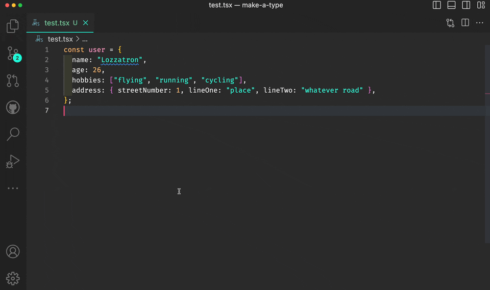

# make-a-type

This extension is available on the [VSCode Marketplace](https://marketplace.visualstudio.com/items?itemName=lwkchan.make-a-type).

I made this because the other available extensions which convert JS to TS either required you to use a JSON object or they created a separate TS file. This extension does not require you to use JSON and captures the TS type in your clipboard so that you can paste it anywhere you want.

## Features

- Highlight a JS Object, and get a TypeScript interface in your clipboard

## Requirements

- VS Code 1.44 or higher

## Usage

1. Highlight your JS object
2. Open command pallette (`Ctrl/Cmd-Shift-P`)
3. Search for "Make JS Object into TS Type: clipboard"
4. Select option
5. TS type is now in your clipboard, now paste it wherever you want to
